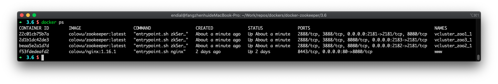
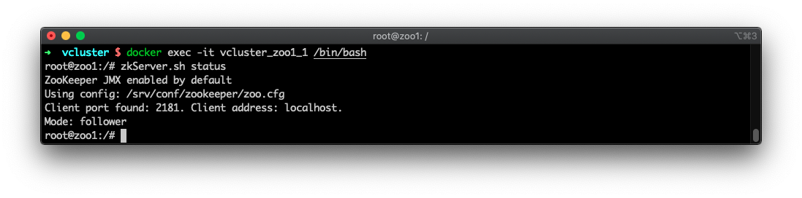
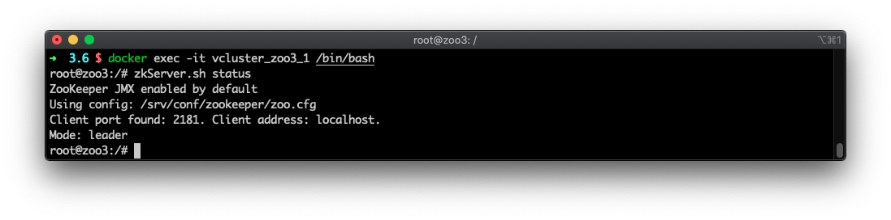

# ZooKeeper

针对 ZooKeeper 应用的 Docker 镜像，用于提供 ZooKeeper 服务。


**版本信息**：

- 3.6、3.6.1、latest
- 3.5、3.5.7

**镜像信息**

* 镜像地址：colovu/zookeeper:latest
  * 依赖镜像：colovu/openjdk:8u242-jre


## 默认对外声明

### 端口

- 2181：Client port
- 2888：Follower port
- 3888：Election port
- 8080：AdminServer port

### 数据卷

镜像默认提供以下数据卷定义：

```shell
/var/log			# 日志输出，应用日志输出，非数据日志输出
/srv/conf			# 配置文件
/srv/data			# 数据文件
/srv/datalog	# 数据操作日志文件
```

如果需要持久化存储相应数据，需要在宿主机建立本地目录，并在使用镜像初始化容器时进行数据卷映射。

举例：

- 使用宿主机`/host/dir/to/conf`存储配置文件
- 使用宿主机`/host/dir/to/data`存储数据文件
- 使用宿主机`/host/dir/to/log`存储日志文件

创建以上相应的宿主机目录后，容器启动命令中对应的数据卷映射参数类似如下：

```shell
-v /host/dir/to/conf:/srv/conf -v /host/dir/to/data:/srv/data -v /host/dir/to/log:/var/log
```

使用 Docker Compose 时配置文件类似如下：

```yaml
services:
  zoo1:
  ...
    volumes:
      - /host/dir/to/conf:/srv/conf
      - /host/dir/to/data:/srv/data
      - /host/dir/to/log:/var/log
  ...
```

> 注意：应用需要使用的子目录会自动创建。


## 使用说明

- 在后续介绍中，启动的容器默认命名为`zoo1`，需要根据实际情况修改
- 在后续介绍中，容器默认使用的网络命名为`app-tier`，需要根据实际情况修改


### 容器网络

在工作在同一个网络组中时，如果容器需要互相访问，相关联的容器可以使用容器初始化时定义的名称作为主机名进行互相访问。

创建网络：

```shell
$ docker network create app-tier --driver bridge
```

- 使用桥接方式，创建一个命名为`app-tier`的网络


如果使用已创建的网络连接不同容器，需要在启动命令中增加类似`--network app-tier`的参数。使用 Docker Compose时，在docker-compose的配置文件中增加：

```yaml
services:
	AppName:
		...
		networks:
    	- app-tier
    
networks:
  app-tier: bridge
```


### 下载镜像

可以不单独下载镜像，如果镜像不存在，会在初始化容器时自动下载。

```shell
# 下载指定Tag的镜像
$ docker pull colovu/zookeeper:tag

# 下载最新镜像
$ docker pull colovu/zookeeper:latest
```

> TAG：替换为指定的标签名


### 持久化数据存储

如果需要将容器数据持久化存储至宿主机或数据存储中，需要确保宿主机对应的路径存在，并在启动时，映射为对应的数据卷。

AppName 镜像默认配置了用于存储数据的数据卷 `/srv/data`及用于存储数据日志的数据卷`/srv/datalog`。可以使用宿主机目录映射相应的数据卷，将数据持久化存储在宿主机中。路径中，应用对应的子目录如果不存在，容器会在初始化时创建，并生成相应的默认文件。

> 注意：将数据持久化存储至宿主机，可避免容器销毁导致的数据丢失。同时，将数据存储及数据日志分别映射为不同的本地设备（如不同的共享数据存储）可提供较好的性能保证。


### 实例化服务容器

生成并运行一个新的容器：

```shell
$ docker run -d --restart always --name zoo1 -e ZOO_ALLOW_ANONYMOUS_LOGIN=yes colovu/zookeeper:latest
```

- `-d`: 使用服务方式启动容器
- `--restart always`: 在容器失败或系统重启后，自动重启容器
- `--name zoo1`: 为当前容器命名
- `-e ZOO_ALLOW_ANONYMOUS_LOGIN=yes`: 设置默认允许任意用户登录（调试时使用，生产系统应当使用认证）


使用数据卷映射生成并运行一个容器：

```shell
 $ docker run -d --restart always \
  --name zoo1 \
  -e ZOO_ALLOW_ANONYMOUS_LOGIN=yes \
  -v /host/dir/to/data:/srv/data \
  -v /host/dir/to/datalog:/srv/datalog \
  -v /host/dir/to/conf:/srv/conf \
  colovu/zookeeper:latest
```


### 连接容器

启用 [Docker container networking](https://docs.docker.com/engine/userguide/networking/)后，工作在容器中的 ZooKeeper 服务可以被其他应用容器访问和使用。

#### 命令行方式

定义网络，并启动 ZooKeeper 容器：

```shell
$ docker network create app-tier --driver bridge

$ docker run -d --restart always --name zoo1 -e ZOO_ALLOW_ANONYMOUS_LOGIN=yes \
	--network app-tier \
	colovu/zookeeper:latest
```

- `--network app-tier`: 容器使用的网络


其他业务容器连接至 ZooKeeper 容器：

```shell
$ docker run --network app-tier --name other-app --link zoo1:zookeeper -d other-app-image:tag
```

- `--link zoo1:zookeeper`: 链接Zookeeper容器，并命名为`zookeeper`进行使用（如果其他容器中使用了该名称进行访问）


#### Docker Compose 方式

如使用配置文件`docker-compose-test.yml`:

```yaml
version: '3.6'

services:
  zoo1:
    image: 'colovu/zookeeper:latest'
    environment:
    	- ZOO_ALLOW_ANONYMOUS_LOGIN=yes
    networks:
      - app-tier
  myapp:
    image: 'other-app-img:tag'
    links:
    	- zoo1:zookeeper
    networks:
      - app-tier
      
networks:
  app-tier:
    driver: bridge
```

> 注意：
>
> - 需要修改 `other-app-img:tag`为相应业务镜像的名字
> - 在其他的应用中，使用`zoo1`连接 ZooKeeper 容器，如果应用不是使用的该名字，可以重定义启动时的命名，或使用`--links name:name-in-container`进行名称映射

启动方式：

```shell
$ docker-compose up -d -f docker-compose-test.yml
```

- 如果配置文件命名为`docker-compose.yml`，可以省略`-f docker-compose-test.yml`参数


#### 其他连接操作

使用 exec 命令访问容器ID或启动时的命名，进入容器并执行命令：

```shell
$ docker exec -it zoo1 /bin/bash
```

- `/bin/bash`: 在进入容器后，运行的命令


使用 attach 命令进入已运行的容器：

```shell
$ docker attach  --sig-proxy=false zoo1
```

- 该方式无法执行命令
- 如果不使用` --sig-proxy=false`，关闭终端或`Ctrl + C`时，会导致容器停止


### 停止容器

使用 stop 命令以容器ID或启动时的命名方式停止容器：

```shell
$ docker stop zoo1
```

使用 ZooKeeper 容器中`zkServer.sh`管理脚本的停止命令停止容器：

```shell
$ docker exec -it zoo1 zkServer.sh stop
```


### 查看日志

默认方式启动容器时，容器的运行日志输出至终端，可使用如下方式进行查看：

```shell
$ docker logs zoo1
```

在使用 Docker Compose 管理容器时，使用以下命令查看：

```shell
$ docker-compose logs zoo1
```


## Docker Compose 部署

### 单机部署

根据需要，修改 Docker Compose 配置文件，如`docker-compose.yml`，并启动:

```bash
$ docker-compose up -d
```

- 在不定义配置文件的情况下，默认使用当前目录的`docker-compose.yml`文件
- 如果配置文件为其他名称，可以使用`-f 文件名`方式指定


`docker-compose.yml`文件参考如下：

```yaml
version: '3.6'

services:
  zoo1:
    image: colovu/zookeeper:latest
    environment:
    	- ZOO_ALLOW_ANONYMOUS_LOGIN=yes
    ports:
      - '2181:2181'
```


#### 环境验证

使用命令行初始化客户端并连接至 ZooKeeper 容器：

```shell
$ docker run -it --rm \
	--network app-tier \
	colovu/zookeeper:latest zkCli.sh -server zoo1:2181  get /
```

- 启动客户端，连接至服务器`zoo1`，并运行命令`get /`


### 集群部署

根据需要，修改 Docker Compose 配置文件，如`docker-compose-cluster.yml`，并启动:

```bash
$ docker-compose -f docker-compose-cluster.yml up -d
```

- 在不定义配置文件的情况下，默认使用当前目录的`docker-compose.yml`文件


配置为 ZooKeeper 集群后，单一机器的宕机不会影响服务的正常提供。建议是用奇数个主机组成集群。如果集群中有5台服务器，则可以支持2台机器的宕机。

针对集群中，当前主机的配置信息，其IP地址必须使用`0.0.0.0`；在配置信息中，其表现为主机ID与server信息中编号一致。如针对ID为1的配置信息，可类似如下：`0.0.0.0:2888:3888;2181 zookeeper2:2888:3888;2181 zookeeper3:2888:3888;2181`。

可以使用 [`docker stack deploy`](https://docs.docker.com/engine/reference/commandline/stack_deploy/) 或 [`docker-compose`](https://github.com/docker/compose) 方式，启动一组服务容器。 `docker-compose.yml` 配置文件（伪集群）参考如下：

```yaml
version: '3.6'

services:
  zoo1:
    image: colovu/zookeeper:latest
    restart: always
    hostname: zoo1
    ports:
      - 2181:2181
      - 2888:2888
      - 3888:3888
      - 8081:8080
    environment:
      - ZOO_SERVER_ID=1
      - ZOO_ALLOW_ANONYMOUS_LOGIN=yes
      - ZOO_SERVERS="server.1=0.0.0.0:2888:3888 server.2=zoo2:4888:5888 server.3=zoo3:6888:7888"

  zoo2:
    image: colovu/zookeeper:latest
    restart: always
    hostname: zoo2
    ports:
      - 2182:2181
      - 4888:2888
      - 5888:3888
      - 8082:8080
    environment:
      - ZOO_SERVER_ID=2
      - ZOO_ALLOW_ANONYMOUS_LOGIN=yes
      - ZOO_SERVERS="server.1=zoo1:2888:3888 server.2=0.0.0.0:4888:5888 server.3=zoo3:6888:7888"

  zoo3:
    image: colovu/zookeeper:latest
    restart: always
    hostname: zoo3
    ports:
      - 2183:2181
      - 6888:2888
      - 7888:3888
      - 8083:8080
    environment:
      - ZOO_SERVER_ID=3
      - ZOO_ALLOW_ANONYMOUS_LOGIN=yes
      - ZOO_SERVERS="server.1=zoo1:2888:3888 server.2=zoo2:4888:5888 server.3=0.0.0.0:6888:7888"
```

> 由于配置的是伪集群模式, 所以各个 server 的端口参数必须不同（使用同一个宿主机的不同端口）


以上方式将以 [replicated mode](https://zookeeper.apache.org/doc/current/zookeeperStarted.html#sc_RunningReplicatedZooKeeper) 启动ZooKeeper 3.5。也可以以  [Docker Swarm](https://www.docker.com/products/docker-swarm) 方式进行配置。

> 注意：在一个机器上设置多个服务容器，并不能提供冗余特性；如果主机因各种原因导致宕机，则所有 ZooKeeper 服务都会下线。如果需要完全的冗余特性，需要在完全独立的不同物理主机中启动服务容器；即使在一个集群的中的不同虚拟主机中启动单独的服务容器也无法完全避免因物理主机宕机导致的问题。


#### 环境验证

使用`docker ps`命令可以查看所有在运行的容器：



使用`docker exec -it container-name /bin/bash`命令进入容器，并使用命令`zkServer.sh status`查看服务状态，至少有一个为`leader`，其余的为`follower`:






## 容器配置


### 常规配置参数

在初始化 ZooKeeper 容器时，如果配置文件`zoo.cfg`不存在，可以在命令行中使用相应参数对默认参数进行修改。类似命令如下：

```shell
$ docker run -d --restart always -e "ZOO_INIT_LIMIT=10" --name zoo1 colovu/zookeeper:latest
```

环境变量主要包括：

#### `ZOO_TICK_TIME`

默认值：**2000**。设置`tickTime`。

> 定义一个 Tick 的时间长度，以微秒为单位。该值为 ZooKeeper 使用的基础单位，用于心跳、超时等控制；如一般 Session 的最小超时时间为2个 Ticks。

#### `ZOO_INIT_LIMIT`

默认值：**10**。设置 `initLimit`。

> 以 ticks 为单位的时间长度。用于控制从服务器与 Leader 连接及同步的时间。如果数据量比较大，可以适当增大该值。

#### `ZOO_SYNC_LIMIT`

默认值：**5**。设置`syncLimit`。

> 以 ticks 为单位的时间长度。用于控制从服务器同步数据的时间。如果从服务器与 Leader 差距过大，将会被剔除。

#### `ZOO_MAX_CLIENT_CNXNS`

默认值：**60**。设置`maxClientCnxns`。

> 每个客户端允许的同时连接数（Socket层）。以 IP 地址来识别客户端。

#### `ZOO_STANDALONE_ENABLED`

默认值：**false**。设置使用启用 Standalone 模式。参考[`standaloneEnabled`](https://zookeeper.apache.org/doc/r3.5.5/zookeeperReconfig.html#sc_reconfig_standaloneEnabled)中的定义。

> 3.5.0版本新增。配置服务器工作模式，支持 Standalone 和 Distributed 两种。在服务器启动后无法重新切换。服务器启动时，默认会设置为 true，服务器将无法动态扩展。为了后续服务器可动态扩展，可设置该值为 false。

#### `ZOO_ADMINSERVER_ENABLED`

默认值：**true**。 设置是否启用管理服务器。参考[`admin.enableServer`](http://zookeeper.apache.org/doc/r3.5.5/zookeeperAdmin.html#sc_adminserver_config)中定义。

> 3.5.0版本新增。 配置是否启用 AdminServer，该服务是一个内置的 Jetty 服务器，可以提供 HTTP 访问端口以支持四字命令。默认情况下，该服务工作在 8080 端口，访问方式为： URL "/commands/[command name]", 例如, http://localhost:8080/commands/stat。

#### `ZOO_AUTOPURGE_PURGEINTERVAL`

默认值：**0**。设置自动清理触发周期，参考 [`autoPurge.purgeInterval`](https://zookeeper.apache.org/doc/current/zookeeperAdmin.html#sc_advancedConfiguration)中的定义。

> 以小时为单位自动清理触发时间。设置为正整数（1 或更大值）以启用服务器自动清理快照及日志功能。设置为 0 则不启用。

#### `ZOO_AUTOPURGE_SNAPRETAINCOUNT`

默认值：**3**。设置自动清理范围，参考[`autoPurge.snapRetainCount`](https://zookeeper.apache.org/doc/current/zookeeperAdmin.html#sc_advancedConfiguration)中的定义。

> 当自动清理功能启用时，保留的最新快照或日志数量；其他的快照及保存在 dataDir、dataLogDir 中的数据将被清除。最小值为 3。

#### `ZOO_4LW_COMMANDS_WHITELIST`

默认值：**srvr, mntr**。设置白名单，参考 [`4lw.commands.whitelist`](https://zookeeper.apache.org/doc/current/zookeeperAdmin.html#sc_clusterOptions)中的定义。

> 以逗号分隔的四字命令。需要将有效的四字命令使用该环境变量进行设置；如果不设置，则对应的四字命令默认不起作用。

#### `ENV_DEBUG`

默认值：**false**。设置是否输出容器调试信息。

> 可设置为：1、true、yes


### 集群配置参数

使用 ZooKeeper 镜像，可以很容易的建立一个 [ZooKeeper](https://zookeeper.apache.org/doc/r3.1.2/zookeeperAdmin.html) 集群。针对 ZooKeeper 的集群模式（复制模式），有以下参数可以配置：

#### `ZOO_SERVER_ID`

默认值：**1**

介于1~255之间的唯一值，用于标识服务器ID。需要注意，如果在初始化容器时使用一个存在`myid`文件的本地路径映射为`/srv/data`数据卷，则相应的参数设置不起作用。文件完整路径为：`/srv/data/zookeeper/myid`。

#### `ZOO_SERVERS`

默认值：**server.1=0.0.0.0:2888:3888**

定义冗余模式时的服务器列表。每个服务器使用类似`server.id=::[:role][;port]`的格式进行定义，如：`server.2=192.168.0.1:2888:3888;2181`。不同的服务器参数使用空格分隔。需要注意，如果在初始化容器时使用一个存在`zoo.cfg`文件的本地路径映射为`/srv/conf`数据卷，则相应的参数设置不起作用。文件完整路径为：`/srv/conf/zookeeper/zoo.conf`。此时如果需要更新配置，只能手动修改配置文件，并重新启动容器。

常用格式为 `server.X=A:B:C;D`，参考信息如下:

- `server.`: 关键字，不可以更改
- X: 数字，当前服务器的ID，在同一个集群中应当唯一
- A: IP地址或主机名（网络中可识别）
- B: 当前服务器与集群中 Leader 交换消息所使用的端口
- C: 选举 Leader 时所使用的端口
- D: Client访问端口，可省略（使用默认端口2181）


更多信息，可参照文档 [Zookeeper Dynamic Reconfiguration](https://zookeeper.apache.org/doc/r3.5.5/zookeeperReconfig.html) 中的介绍。


### 可选配置参数

如果没有必要，可选配置参数可以不用定义，直接使用对应的默认值，主要包括：

#### `ZOO_BASE_DIR`

默认值：**/usr/local/zookeeper**。设置应用的默认基础目录。

#### `ZOO_DATA_DIR`

默认值：**/usr/data/zookeeper**。设置应用的默认数据存储目录。

#### `ZOO_DATA_LOG_DIR`

默认值：**/usr/datalog/zookeeper**。设置应用的默认数据日志目录。

#### `ZOO_CONF_DIR`

默认值：**/usr/conf/zookeeper**。设置应用的默认配置文件目录。

#### `ZOO_LOG_DIR`

默认值：**/var/log/zookeeper**。设置应用的默认日志目录。

#### `ZOO_DAEMON_USER`

默认值：**zookeeper**。设置应用的默认运行用户。

#### `ZOO_DAEMON_GROUP`

默认值：**zookeeper**。设置应用的默认运行用户组。

#### `ZOO_PORT_NUMBER`

默认值：**2181**。设置应用的默认客户访问端口。

#### `ZOO_MAX_CNXNS`

默认值：**0**。设置当前服务器最大连接数。设置为 0 则无限制。

#### `ZOO_LOG_LEVEL`

默认值：**INFO**。设置日志输出级别，取值范围：`ALL`, `DEBUG`, `INFO`, `WARN`, `ERROR`, `FATAL`, `OFF`, `TRACE`。

#### `ZOO_RECONFIG_ENABLED`

默认值：**no**。设置是否启用动态重新配置功能。

#### `ZOO_LISTEN_ALLIPS_ENABLED`

默认值：**no**。设置是否默认监听所有 IP。

#### `ZOO_ENABLE_PROMETHEUS_METRICS`

默认值：**no**。设置是否输出 Prometheus 指标。

#### `ZOO_PROMETHEUS_METRICS_PORT_NUMBER`

默认值：**7000**。设置 Jetty 默认输出 Prometheus 指标的端口。

#### `ZOO_ENABLE_AUTH`

默认值：**no**。设置是否启用认证。使用  SASL/Digest-MD5 加密。

#### `ZOO_ALLOW_ANONYMOUS_LOGIN`

默认值：**no**。设置是否允许匿名连接。如果没有设置`ZOO_ENABLE_AUTH`，则必须设置当前环境变量为 `yes`。

#### `ZOO_CLIENT_USER`

默认值：**无**。客户端认证的用户名。

#### `ZOO_CLIENT_PASSWORD`

默认值：**无**。客户端认证的用户密码。

#### `ZOO_CLIENT_PASSWORD_FILE`

默认值：**无**。以绝对地址指定的客户端认证用户密码存储文件。该路径指的是容器内的路径。

#### `ZOO_SERVER_USERS`

默认值：**无**。服务端创建的用户列表。多个用户使用逗号、分号、空格分隔。

#### `ZOO_SERVER_PASSWORDS`

默认值：**无**。服务端创建的用户对应的密码。多个用户密码使用逗号、分号、空格分隔。例如：pass4user1, pass4user2, pass4admin。

#### `ZOO_SERVER_PASSWORDS_FILE`

默认值：**无**。以绝对地址指定的服务器用户密码存储文件。多个用户密码使用逗号、分号、空格分隔。例如：pass4user1, pass4user2, pass4admin。该路径指的是容器内的路径。

#### `JVMFLAGS`

默认值：**无**。设置服务默认的 JVMFLAGS。

#### `ZOO_HEAP_SIZE`

默认值：**1024**。设置以 MB 为单位的 Java Heap 参数（Xmx 与 Xms）。如果在 JVMFLAGS 中已经设置了 Xmx 与 Xms，则当前设置会被忽略。


### SSL配置参数

使用证书加密传输时，相关配置参数如下：

#### `ZOO_TLS_CLIENT_ENABLE`

- `ZOO_TLS_PORT_NUMBER`
- `ZOO_TLS_CLIENT_KEYSTORE_FILE`
- `ZOO_TLS_CLIENT_KEYSTORE_PASSWORD`
- `ZOO_TLS_CLIENT_TRUSTSTORE_FILE`
- `ZOO_TLS_CLIENT_TRUSTSTORE_PASSWORD`

#### `ZOO_TLS_QUORUM_ENABLE`

- `ZOO_TLS_QUORUM_KEYSTORE_FILE`
- `ZOO_TLS_QUORUM_KEYSTORE_PASSWORD`
- `ZOO_TLS_QUORUM_TRUSTSTORE_FILE`
- `ZOO_TLS_QUORUM_TRUSTSTORE_PASSWORD`


### 应用配置文件

应用配置文件默认存储在容器内：`/srv/conf/zookeeper/zoo.cfg`。

#### 使用已有配置文件

Zookeeper 容器的配置文件默认存储在数据卷`/srv/conf`中，文件名及子路径为`zookeeper/zoo.cfg`。有以下两种方式可以使用自定义的配置文件：

- 直接映射配置文件

```shell
$ docker run -d --restart always --name zoo1 -v $(pwd)/zoo.cfg:/srv/conf/zookeeper/zoo.cfg colovu/zookeeper:latest
```

- 映射配置文件数据卷

```shell
$ docker run -d --restart always --name zoo1 -v $(pwd):/srv/conf colovu/zookeeper:latest
```

> 第二种方式时，本地路径中需要包含zookeeper子目录，且相应文件存放在该目录中


#### 生成配置文件并修改

对于没有本地配置文件的情况，可以使用以下方式进行配置。

##### 使用镜像初始化容器

使用宿主机目录映射容器数据卷，并初始化容器：

```shell
$ docker run -d --restart always --name zookeeper -v /host/path/to/conf:/srv/conf colovu/zookeeper:latest
```

or using Docker Compose:

```yaml
version: '3.1'

services:
  zookeeper:
    image: 'colovu/zookeeper:latest'
    ports:
      - '2181:2181'
    volumes:
      - /host/path/to/conf:/srv/conf
```

##### 修改配置文件

在宿主机中修改映射目录下子目录`zookeeper`中文件`zoo.cfg`：

```shell
$ vi /path/to/zoo.cfg
```

##### 重新启动容器

在修改配置文件后，重新启动容器，以使修改的内容起作用：

```shell
$ docker restart zookeeper
```

或者使用 Docker Compose：

```shell
$ docker-compose restart zookeeper
```


## 安全

### 用户认证【TODO】

通过配置环境变量`ZOO_ENABLE_AUTH`，可以启用基于 SASL/Digest-MD5 加密的用户认证功能。在启用用户认证时，同时需要设置允许登录相应用户名及密码。

> 启用认证后，用户使用 CLI 工具`zkCli.sh`时，也需要进行认证，相应的用户及密码通过`ZOO_CLIENT_USER` 与 `ZOO_CLIENT_PASSWORD` 环境变量进行设置。

命令行使用参考：

```
$ docker run -it -e ZOO_ENABLE_AUTH=yes \
		-e ZOO_SERVER_USERS=user1,user2 \
    -e ZOO_SERVER_PASSWORDS=pass4user1,pass4user2 \
    -e ZOO_CLIENT_USER=user1 \
    -e ZOO_CLIENT_PASSWORD=pass4user1 \
    colovu/zookeeper:latest
```

使用 Docker Compose 时，`docker-compose.yml`应包含类似如下配置：

```
services:
  zookeeper:
  ...
    environment:
      - ZOO_ENABLE_AUTH=yes
      - ZOO_SERVER_USERS=user1,user2
      - ZOO_SERVER_PASSWORDS=pass4user1,pass4user2
      - ZOO_CLIENT_USER=user1
      - ZOO_CLIENT_PASSWORD=pass4user1
  ...
```


### 持久化数据存储

ZooKeeper 镜像默认配置了用于存储数据及数据日志的数据卷 `/srv/data`和`/srv/datalog`。可以使用宿主机目录映射相应的数据卷，将数据持久化存储在宿主机中。

> 注意：将数据持久化存储至宿主机，可避免容器销毁导致的数据丢失。同时，将数据存储及数据日志分别映射为不同的本地设备（如不同的共享数据存储）可提供较好的性能保证。


## 日志

默认情况下，Docker镜像配置为将容器日志直接输出至`stdout`，可以使用以下方式查看：

```bash
$ docker logs zoo1
```

使用 Docker Compose 管理时，使用以下命令：

```bash
$ docker-compose logs zoo1
```


实际使用时，可以配置将相应信息输出至`/srv/log`数据卷的相应文件中。配置方式使用 `ZOO_LOG4J_PROP` 类似如下在容器实例化时进行配置：

```shell
$ docker run -d --restart always --name zoo1 -e ZOO_LOG4J_PROP="INFO,ROLLINGFILE" colovu/zookeeper:latest
```

使用该配置后，相应的系统日志文件，将会存储在数据卷`/var/log`的 `zookeeper/zookeeper.log`文件中。

更多有关日志的使用帮助，可参考文档 [ZooKeeper Logging](https://zookeeper.apache.org/doc/current/zookeeperAdmin.html#sc_logging) 中更多说明。


## 容器维护

### 容器数据备份

默认情况下，镜像都会提供`/srv/data`数据卷持久化保存数据。如果在容器创建时，未映射宿主机目录至容器，需要在删除容器前对数据进行备份，否则，容器数据会在容器删除后丢失。

如果需要备份数据，可以使用按照以下步骤进行：

#### 停止当前运行的容器

如果使用命令行创建的容器，可以使用以下命令停止：

```bash
$ docker stop zoo1
```

如果使用 Docker Compose 创建的，可以使用以下命令停止：

```bash
$ docker-compose stop zoo1
```

#### 执行备份命令

在宿主机创建用于备份数据的目录`/path/to/back-up`，并执行以下命令：

```bash
$ docker run --rm -v /path/to/back-up:/backups --volumes-from zoo1 busybox \
  cp -a /srv/data/zookeeper /backups/
```

如果容器使用 Docker Compose 创建，执行以下命令：

```bash
$ docker run --rm -v /path/to/back-up:/backups --volumes-from `docker-compose ps -q zoo1` busybox \
  cp -a /srv/data/zookeeper /backups/
```


### 容器数据恢复

在容器创建时，如果未映射宿主机目录至容器数据卷，则容器会创建私有数据卷。如果是启动新的容器，可直接使用备份的数据进行数据卷映射，命令类似如下：

```bash
$ docker run -v /path/to/back-up:/srv/data colovu/zookeeper:latest
```

使用 Docker Compose 管理时，可直接在`docker-compose.yml`文件中指定：

```yaml
zoo1:
	volumes:
		- /path/to/back-up:/srv/data
```


### 镜像更新

针对当前镜像，会根据需要不断的提供更新版本。针对更新版本（大版本相同的情况下，如果大版本不同，需要参考指定说明处理），可使用以下步骤使用新的镜像创建容器：

#### 获取新版本的镜像

```bash
$ docker pull colovu/zookeeper:TAG
```

这里`TAG`为指定版本的标签名，如果使用最新的版本，则标签为`latest`。

#### 停止容器并备份数据

如果容器未使用宿主机目录映射为容器数据卷的方式创建，参照`容器数据备份`中方式，备份容器数据。

如果容器使用宿主机目录映射为容器数据卷的方式创建，不需要备份数据。

#### 删除当前使用的容器

```bash
$ docker rm -v zoo1
```

使用 Docker Compose 管理时，使用以下命令：

```bash
$ docker-compose rm -v zoo1
```

#### 使用新的镜像启动容器

将宿主机备份目录映射为容器数据卷，并创建容器：

```bash
$ docker run --name zoo1 -v /path/to/back-up:/srv/data colovu/zookeeper:TAG
```

使用 Docker Compose 管理时，确保`docker-compose.yml`文件中包含数据卷映射指令，使用以下命令启动：

```bash
$ docker-compose up zoo1
```


## 注意事项

- 容器中启动参数不能配置为后台运行，如果应用使用后台方式运行，则容器的启动命令会在运行后自动退出，从而导致容器退出；只能使用前台运行方式，即：`start-foreground`


## 更新记录

- 3.6.1、latest
- 3.5.7


----

本文原始来源 [Endial Fang](https://github.com/colovu) @ [Github.com](https://github.com)
