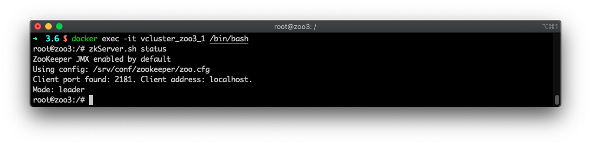

# 简介

主要介绍使用 Docker Compose 对集群中各主机配置及相应业务启动。

配置为 ZooKeeper 集群后，单一机器的宕机不会影响服务的正常提供。建议是用奇数个主机组成集群。如果集群中有5台服务器，则可以支持2台机器的宕机。

使用 ZooKeeper 镜像，可以很容易的建立一个 [ZooKeeper](https://zookeeper.apache.org/doc/r3.1.2/zookeeperAdmin.html) 集群。建立集群时，需要使用以下环境变量： 

- `ZOO_SERVER_ID`: 服务器 ID 
- `ZOO_SERVERS`: 以逗号、分号、空格表示的服务器列表。如：zoo1:2888:3888,zoo2:2888:3888

集群中，当前主机的配置信息，其IP地址必须使用`0.0.0.0`；在配置信息中，其表现为主机ID与server信息中编号一致。如针对ID为1的配置信息，可类似如下：`0.0.0.0:2888:3888 zoo2:2888:3888 zoo:2888:3888`。

## 物理集群

如三台服务器IP分别为：

- 192.168.0.1
- 192.168.0.2
- 192.168.0.3

### 创建第一个节点

使用镜像在第一台服务器中创建第一个节点容器：

```
$ docker run --name zookeeper1 \
  -e ZOO_SERVER_ID=1 \
  -e ZOO_SERVERS=server.1=0.0.0.0:2888:3888 server.2=192.168.0.2:2888:3888 server.3=192.168.0.3:2888:3888 \
  -e ZOO_ALLOW_ANONYMOUS_LOGIN=yes \
  -p 2181:2181 \
  -p 2888:2888 \
  -p 3888:3888 \
  colovu/zookeeper:latest
```


### 创建第二个节点

在第二台服务器中创建第二个节点容器：

```
$ docker run --name zookeeper2 \
  -e ZOO_SERVER_ID=2 \
  -e ZOO_SERVERS=server.1=192.168.0.1:2888:3888 server.2=0.0.0.0:2888:3888 server.3=192.168.0.3:2888:3888 \
  -e ZOO_ALLOW_ANONYMOUS_LOGIN=yes \
  -p 2181:2181 \
  -p 2888:2888 \
  -p 3888:3888 \
  colovu/zookeeper:latest
```


### 创建第三个个节点

在第三台服务器中创建第三个节点容器：

```
$ docker run --name zookeeper3 \
  -e ZOO_SERVER_ID=3 \
  -e ZOO_SERVERS=server.1=192.168.0.1:2888:3888 server.2=192.168.0.2:2888:3888 server.3=0.0.0.0:2888:3888 \
  -e ZOO_ALLOW_ANONYMOUS_LOGIN=yes \
  -p 2181:2181 \
  -p 2888:2888 \
  -p 3888:3888 \
  colovu/zookeeper:latest
```

三台服务器全部启动后，ZooKeeper集群已经在正常运行并提供服务。可以在任何时间通过 增加/移除 服务器对集群进行调整。


## 伪集群

使用 Docker Compose 可以部署一个虚拟集群:

```yaml
version: '3.6'

services:
  zoo1:
    image: colovu/zookeeper:latest
    restart: always
    hostname: zoo1
    ports:
      - 2181:2181
    environment:
      - ZOO_SERVER_ID=1
      - ZOO_ALLOW_ANONYMOUS_LOGIN=yes
      - ZOO_LISTEN_ALLIPS_ENABLED=yes
      - ZOO_SERVERS=server.1=0.0.0.0:2888:3888,server.2=zoo2:2888:3888,server.3=zoo3:2888:3888

  zoo2:
    image: colovu/zookeeper:latest
    restart: always
    hostname: zoo2
    ports:
      - 2182:2181
    environment:
      - ZOO_SERVER_ID=2
      - ZOO_ALLOW_ANONYMOUS_LOGIN=yes
      - ZOO_LISTEN_ALLIPS_ENABLED=yes
      - ZOO_SERVERS=server.1=zoo1:2888:3888,server.2=0.0.0.0:2888:3888,server.3=zoo3:2888:3888

  zoo3:
    image: colovu/zookeeper:latest
    restart: always
    hostname: zoo3
    ports:
      - 2183:2181
    environment:
      - ZOO_SERVER_ID=3
      - ZOO_ALLOW_ANONYMOUS_LOGIN=yes
      - ZOO_LISTEN_ALLIPS_ENABLED=yes
      - ZOO_SERVERS=server.1=zoo1:2888:3888,server.2=zoo2:2888:3888,server.3=0.0.0.0:2888:3888
```

> 因在同一台机器中，不同容器不能使用同一个Client Port，因此，使用不同的端口进行映射。
>
> 如果同时映射其他端口，同样需要跳变。


## 集群验证

使用`docker ps`命令可以查看所有在运行的容器：


使用`docker exec -it container-name /bin/bash`命令进入容器，并使用命令`zkServer.sh status`查看服务状态，至少有一个为`leader`，其余的为`follower`:





----

本文原始来源 [Endial Fang](https://github.com/endial) @ [Github.com](https://github.com)
